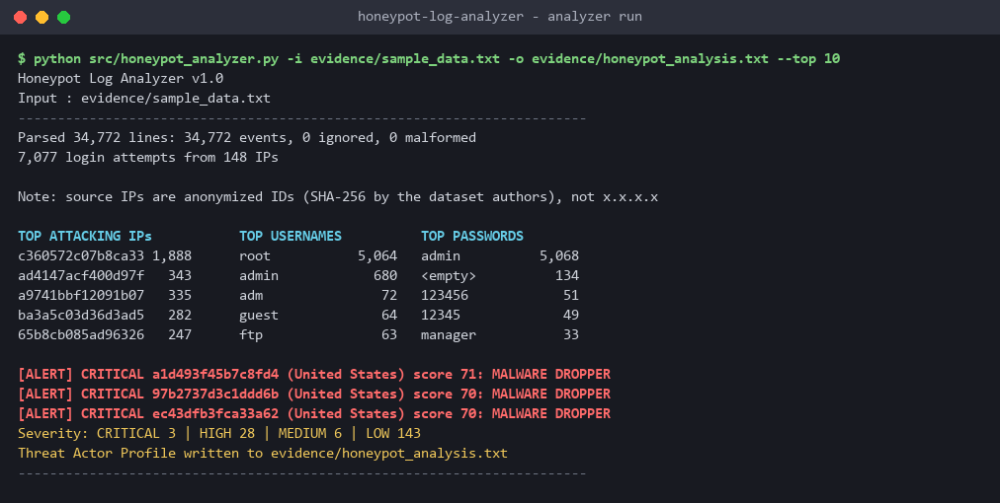
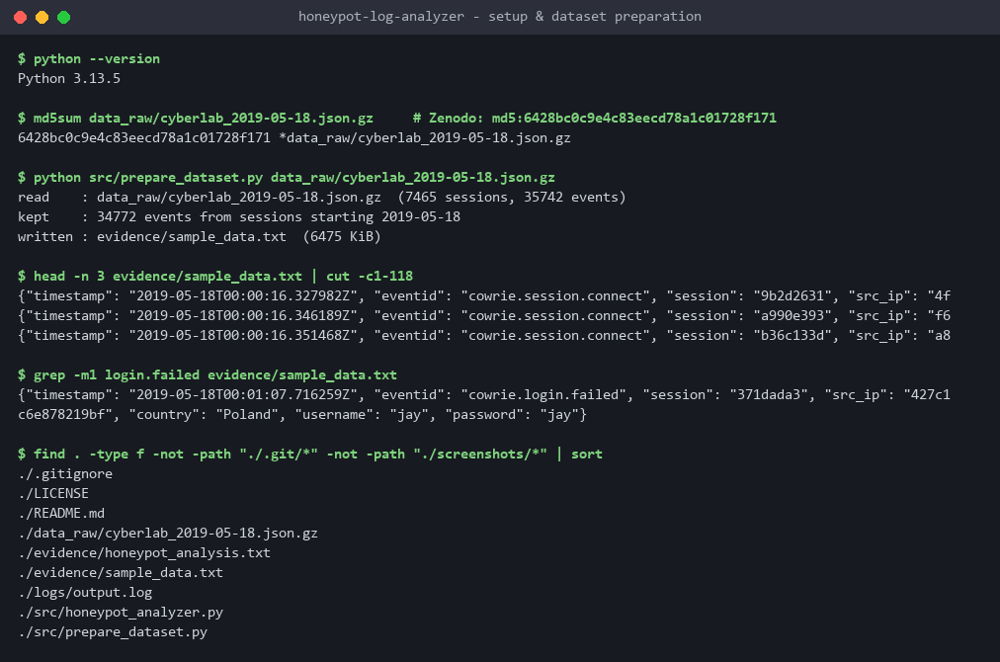
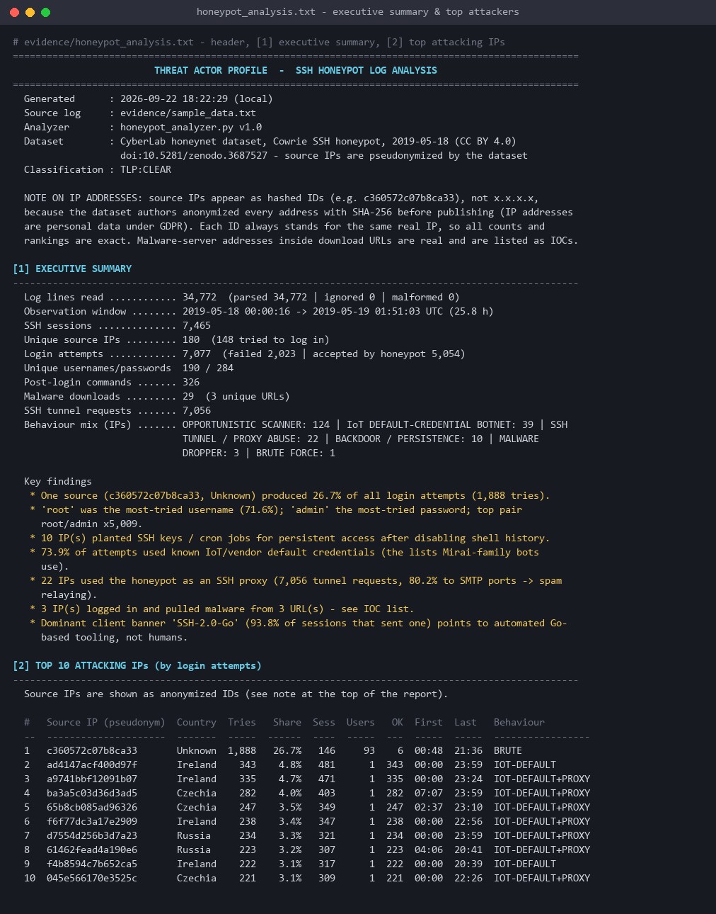
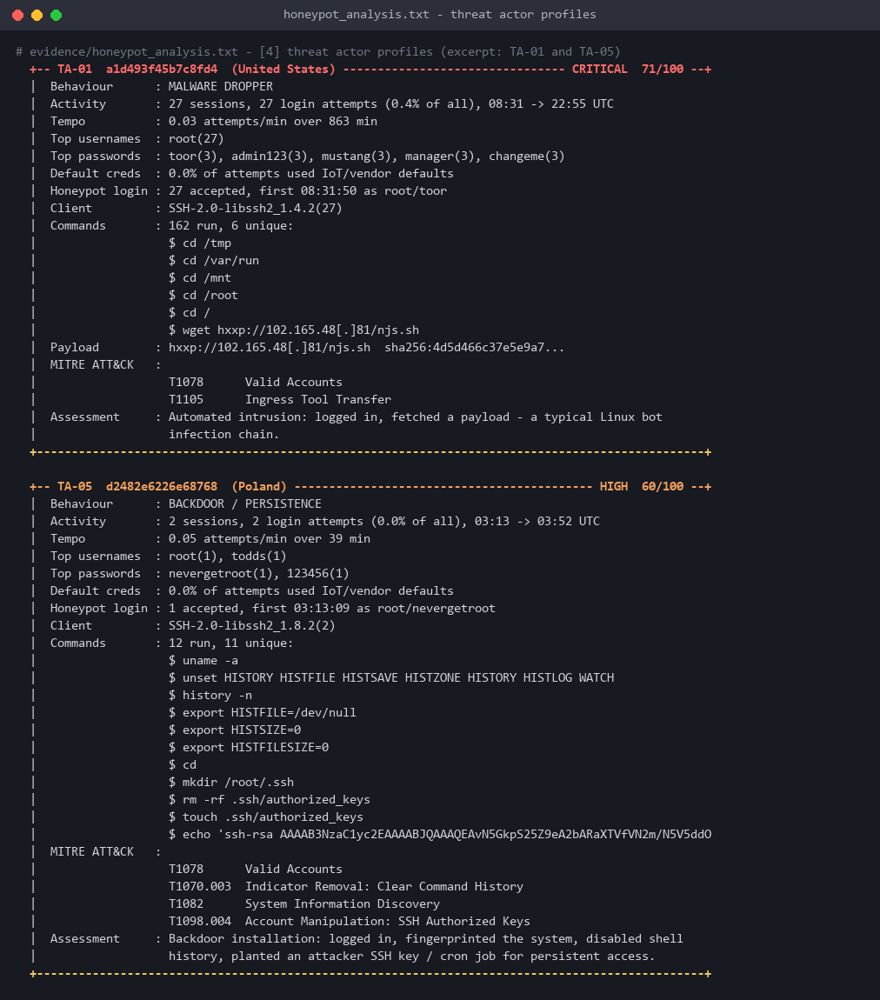
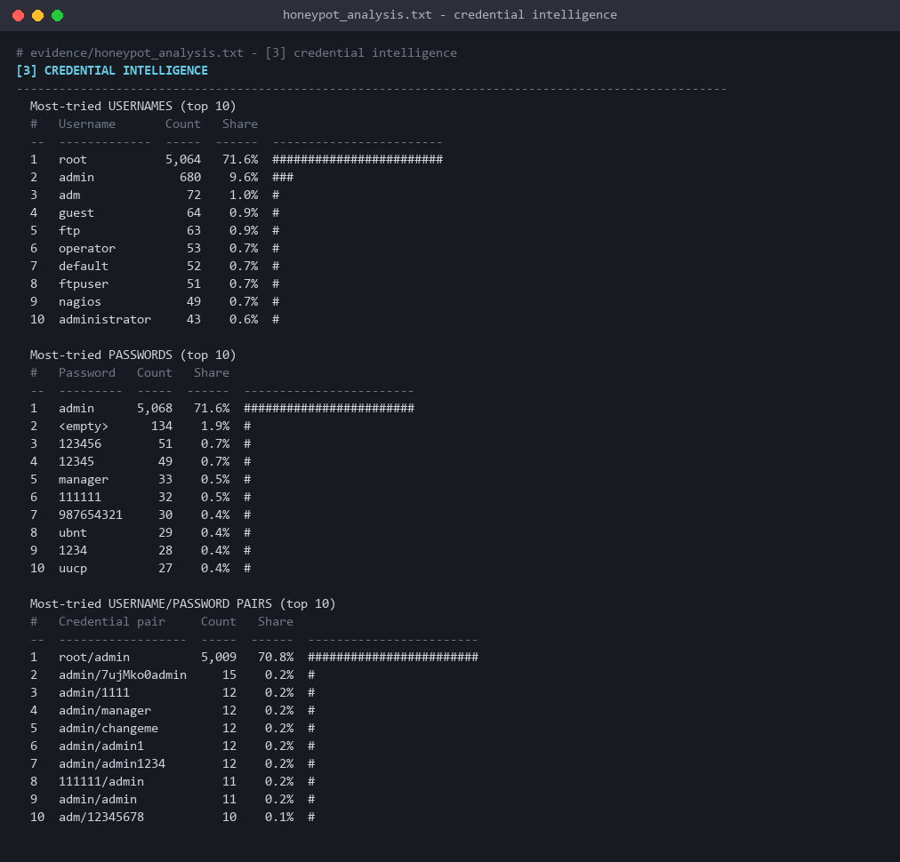
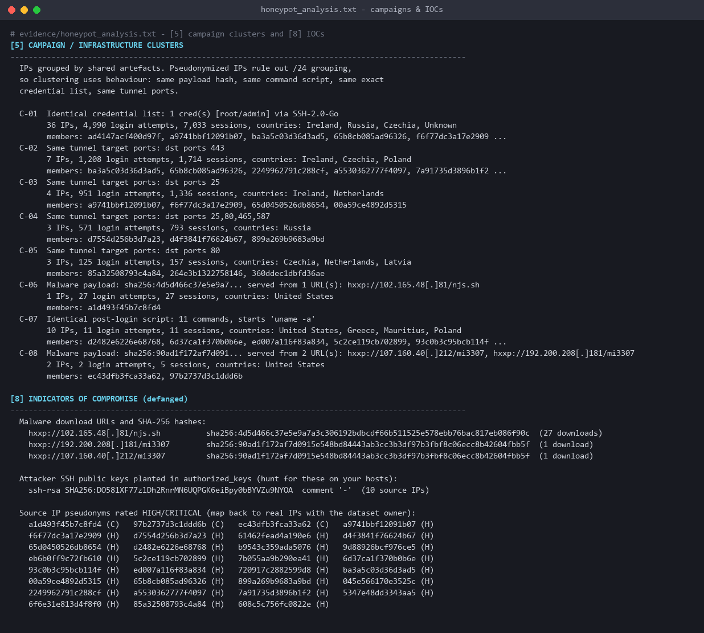

# Honeypot Log Analyzer: SSH Threat Actor Profiling

A Python tool that parses SSH honeypot logs and turns them into threat intelligence. It covers:

- **top attacking IPs**
- **most-tried usernames**
- **most-tried passwords and credential pairs**
- per-attacker behaviour profiles mapped to **MITRE ATT&CK**, with risk scores
- campaign clustering
- a defanged IOC list

The results are written to a **Threat Actor Profile** report, [`evidence/honeypot_analysis.txt`](evidence/honeypot_analysis.txt).

The input is **real attacker traffic**, not made-up data: one day (2019-05-18) of the public, citable [CyberLab honeynet dataset](https://doi.org/10.5281/zenodo.3687527), captured by Cowrie SSH honeypots. It holds 34,772 events, 7,077 login attempts and 180 source IPs.

- **Focus:** threat intelligence, log analysis, attacker profiling

> **Why do the IPs look like `c360572c07b8ca33` instead of `x.x.x.x`?**
> The dataset authors anonymized every source IP with SHA-256 before publishing it, because IP addresses count as personal data under EU privacy law (GDPR). Each ID always stands for the same real IP, so every count and ranking is exact; only the address itself is hidden. Run the analyzer on your own Cowrie `cowrie.json` and the same report shows normal `x.x.x.x` addresses. The report prints this note too.
- **Language:** Python 3.8+, **standard library only**



---

## Table of contents
1. [What it does](#what-it-does)
2. [Key findings from the dataset](#key-findings-from-the-dataset)
3. [Repository structure](#repository-structure)
4. [Setup and usage](#setup-and-usage)
5. [The data](#the-data)
6. [How the analysis works](#how-the-analysis-works)
7. [Report sections](#report-sections)
8. [Screenshots](#screenshots)
9. [Verification](#verification)
10. [Limitations and future work](#limitations-and-future-work)
11. [5-line summary](#5-line-summary)
12. [Credits and license](#credits-and-license)

---

## What it does

| Capability | Details |
|---|---|
| **Log parsing** | Reads Cowrie JSON-lines logs one line at a time. Malformed lines (bad JSON, missing fields, invalid timestamps) are counted and logged, never fatal. |
| **Top-N statistics** | Attacking IPs, usernames, passwords, username/password pairs, SSH client banners, source countries. |
| **Behaviour classification** | Every source IP gets tags: brute force, IoT default-credential botnet, SSH tunnel/proxy abuse, malware dropper, backdoor/persistence, opportunistic scanner. |
| **MITRE ATT&CK mapping** | Login behaviour and post-login commands are mapped to techniques (T1110.x, T1078.x, T1090, T1105, T1059.004, T1070.003, T1082, T1098.004, ...). |
| **Risk scoring** | A transparent 0-100 score and severity (LOW / MEDIUM / HIGH / CRITICAL) for each attacker. |
| **Threat actor profiles** | One profile per notable attacker: tempo, credentials, commands, payloads, TTPs and a written assessment. |
| **Campaign clustering** | Groups IPs that share a malware hash, an identical post-login script, an identical credential list or the same tunnel ports. |
| **IOC extraction** | Defanged payload URLs, SHA-256 hashes, and **fingerprints of attacker SSH keys** planted in `authorized_keys`. |
| **Evidence logging** | Every run writes a timestamped log to [`logs/output.log`](logs/output.log). |

---

## Key findings from the dataset

These numbers come from [`evidence/honeypot_analysis.txt`](evidence/honeypot_analysis.txt):

| Metric | Value |
|---|---|
| Events parsed | 34,772 (0 malformed) over 25.8 h |
| SSH sessions | 7,465 |
| Login attempts | 7,077 from 148 IPs (180 IPs in total) |
| **Top attacking IP** | `c360572c07b8ca33`: **1,888 attempts (26.7%)**, 93 different usernames |
| **Most-tried username** | `root` (5,064, 71.6%), then `admin` (680) |
| **Most-tried password** | `admin` (5,068, 71.6%), then `<empty>` (134), `123456`, `12345` |
| **Top credential pair** | `root/admin` ×5,009 |
| Default-credential share | **73.9%** of attempts used known IoT/vendor defaults |
| SSH tunnel abuse | 22 IPs, 7,056 tunnel requests, **80% to SMTP ports** (spam relaying) |
| Malware | 29 downloads, 3 URLs, 2 unique SHA-256 payloads |
| Backdoors | 10 IPs in 7 countries ran the **same 11-command script**: history wiping, then planting one attacker SSH key |

Highlights:

- **The biggest botnet did not guess passwords.** 36 IPs using a Go-based SSH client (`SSH-2.0-Go`) logged in with `root/admin` and nothing else, across 7,000+ sessions. 22 IPs, most of them from this group, then used the honeypot as an **SMTP spam relay or web proxy**. Many tools would call this "brute force", but the analyzer spots that each IP uses only one credential and classifies it correctly.
- **One IP is the real brute-forcer.** It sent 1,888 attempts with 93 usernames (`admin`, `adm`, `guest`, `ftp`, ...).
- **One tool, many hosts.** The backdoor script ran identically from 10 IPs in 7 countries. That points to a single operator or kit. Its SSH key fingerprint (`SHA256:DO581XF77zlDh2RnrMN6UQPGK6eiBpy0bBYVZu9NYOA`) is a strong, huntable IOC.
- **One payload, two servers.** Two download URLs on different servers served the same file (`sha256:90ad1f17...`). Clustering by hash links them.

---

## Repository structure

```
honeypot-log-analyzer/
├── README.md
├── LICENSE
├── .gitignore
├── src/
│   ├── honeypot_analyzer.py     # the analyzer: parse, aggregate, classify, report
│   └── prepare_dataset.py       # converts the raw Zenodo file into the evidence log
├── screenshots/
│   ├── 01_setup.png             # environment, checksum check, dataset preparation
│   ├── 02_output.png            # analyzer console run
│   ├── 03_findings.png          # executive summary + top attacking IPs
│   ├── 04_threat_actor_profiles.png
│   ├── 05_credential_intel.png
│   └── 06_campaigns_iocs.png
├── logs/
│   └── output.log               # timestamped run log (INFO + DEBUG)
└── evidence/
    ├── sample_data.txt          # input: 34,772 real Cowrie events (JSON lines)
    └── honeypot_analysis.txt    # output: the Threat Actor Profile
```

---

## Setup and usage

No packages to install. Python 3.8 or newer is enough.

```bash
git clone https://github.com/b33pl0g1c/honeypot-log-analyzer.git
cd honeypot-log-analyzer

# Run the analyzer on the included evidence log
python src/honeypot_analyzer.py
```

Options:

```text
python src/honeypot_analyzer.py [-i INPUT] [-o OUTPUT] [-l LOG] [-n TOP] [-v]

  -i, --input    Cowrie JSON-lines log      (default: evidence/sample_data.txt)
  -o, --output   report file                (default: evidence/honeypot_analysis.txt)
  -l, --log      run log, '' to disable     (default: logs/output.log)
  -n, --top      rows in the top-N tables   (default: 10)
  -v, --verbose  print debug messages (e.g. each malformed line) to the console
```

The analyzer also reads a **Cowrie `cowrie.json` file from your own honeypot** directly. It understands the native `cowrie.command.input` events and uses `src_ip` as the attacker key. Real IPs work the same way as the dataset's pseudonyms.

### Rebuilding the evidence log from the original dataset (optional)

```bash
mkdir data_raw
curl -L -o data_raw/cyberlab_2019-05-18.json.gz \
  "https://zenodo.org/api/records/3687527/files/cyberlab_2019-05-18.json.gz/content"
md5sum data_raw/cyberlab_2019-05-18.json.gz     # expect 6428bc0c9e4c83eecd78a1c01728f171
python src/prepare_dataset.py data_raw/cyberlab_2019-05-18.json.gz
```

The other daily files (e.g. `cyberlab_2019-05-21.json.gz`) use the same format and should work the same way. Only 2019-05-18 has been tested.

---

## The data

**Source:** Sedlar, U., Kren, M., Štefanič Južnič, L., Volk, M. (2020). *CyberLab honeynet dataset.* Zenodo. [doi:10.5281/zenodo.3687527](https://doi.org/10.5281/zenodo.3687527). License: CC BY 4.0.

About 50 Cowrie honeypots at EU and US universities and companies recorded every connection, credential, command and download. The dataset authors **pseudonymized all IP addresses as SHA-256 hashes**. This README and the report show the first 16 hex characters (e.g. `c360572c07b8ca33`), so no real source IP is exposed here. The payload-server addresses inside the malware URLs are kept, because they are the IOCs. Country geolocation was done by the authors before hashing.

`src/prepare_dataset.py` flattens the dataset's nested `{session: [events]}` layout into one event per line, in Cowrie's own JSON-lines shape. It keeps only the fields the analyzer needs. It drops:

- raw tunnelled payloads (`direct-tcpip.data`, which contains spam bodies)
- SSH handshake noise
- 8 stray events dated two weeks later

Sample lines from [`evidence/sample_data.txt`](evidence/sample_data.txt):

```json
{"timestamp": "2019-05-18T00:01:07.716259Z", "eventid": "cowrie.login.failed", "session": "371dada3", "src_ip": "427c1c6e878219bf", "country": "Poland", "username": "jay", "password": "jay"}
{"timestamp": "2019-05-18T08:31:52.484100Z", "eventid": "cowrie.session.file_download", "session": "17619627", "src_ip": "a1d493f45b7c8fd4", "country": "United States", "url": "http://102.165.48.81/njs.sh", "shasum": "4d5d466c..."}
{"timestamp": "2019-05-18T00:10:15.449377Z", "eventid": "cowrie.direct-tcpip.request", "session": "e58b04e1", "src_ip": "85a32508793c4a84", "country": "Czechia", "dst_ip": "8e8fc28a9a0ec2f3", "dst_port": 80}
```

> ⚠️ The URLs in the evidence file are **live-style malware URLs from 2019**. The report shows them defanged (`hxxp://102.165.48[.]81/...`). Do not visit them.

---

## How the analysis works

```
sample_data.txt ──► parse_log()     JSON-lines → Event objects (bad lines counted, skipped)
                ──► build_actors()  per-IP aggregation: attempts, creds, sessions, commands,
                                    downloads, tunnels, client banners, first/last seen
                ──► classify()      behaviour tags + ATT&CK techniques + 0-100 risk score
                ──► find_campaigns() cluster IPs by payload hash / script / cred list / ports
                ──► build_report()  8-section Threat Actor Profile → honeypot_analysis.txt
                ──► console_summary() + logs/output.log
```

### Behaviour classification rules

| Tag | Rule | ATT&CK |
|---|---|---|
| **Brute force** | ≥ 10 distinct credential pairs **and** (≥ 100 attempts, or ≥ 20 attempts at ≥ 5/min) | T1110.001 Password Guessing |
| **IoT default-credential botnet** | ≥ 5 attempts, ≥ 50% of them from a known default list (the Mirai scanner table + vendor defaults) | T1110.004, T1078.001 Default Accounts |
| **SSH tunnel / proxy abuse** | Any `direct-tcpip` request, i.e. the attacker forwards traffic through the host. SMTP ports mean spam relaying. | T1090 Proxy |
| **Malware dropper** | A file download or a `wget`/`curl`/`tftp` command after login | T1105 Ingress Tool Transfer |
| **Backdoor / persistence** | Writes `~/.ssh/authorized_keys` or cron entries | T1098.004, T1053.003 |
| **Opportunistic scanner** | None of the above | T1110.001 |

Post-login commands are also matched against patterns for T1082 (discovery: `uname`, `/proc/cpuinfo`), T1070.003 (history wiping: `unset HISTFILE`, `history -n`), T1059.004 (script execution) and T1496 (miners).

The "distinct credentials" condition matters. Without it, a bot that logs in 300 times with the *same* password gets labelled brute force. With it, the tool correctly sees credential reuse plus proxy abuse.

### Risk score (0-100)

```
volume  min(25, attempts/20)   brute force      +15   IoT defaults      +10
post-auth activity             +20   tunnels     +15   SMTP tunnels      +5
commands                       +10   download    +40   history wiping    +5
persistence                    +25   (capped at 100)
≥70 CRITICAL · ≥50 HIGH · ≥30 MEDIUM · else LOW
```

Note: a honeypot accepts logins on purpose. "Accepted" means the attacker got a *fake* shell, which reveals what they would do on a real host.

---

## Report sections

[`evidence/honeypot_analysis.txt`](evidence/honeypot_analysis.txt) contains:

1. **Executive summary:** volumes, time window, behaviour mix, key findings
2. **Top attacking IPs:** attempts, share, sessions, distinct usernames, accepted logins, first/last seen, behaviour
3. **Credential intelligence:** top usernames, passwords, pairs, SSH client banners, source countries
4. **Threat actor profiles:** one block per notable attacker, with tempo, credentials, commands, payloads, ATT&CK and an assessment
5. **Campaign / infrastructure clusters:** IPs linked by shared artefacts
6. **Timeline:** login attempts and tunnel requests per hour (ASCII histogram)
7. **Defensive recommendations:** built from what was observed
8. **Indicators of compromise:** defanged URLs, SHA-256 hashes, SSH key fingerprints, high-risk IPs

Excerpt (abridged):

```
  +-- TA-05  d2482e6226e68768  (Poland) ----------------------------------------- HIGH  60/100 --+
  |  Behaviour      : BACKDOOR / PERSISTENCE
  |  Honeypot login : 1 accepted, first 03:13:09 as root/nevergetroot
  |  Commands       : 12 run, 11 unique:
  |                   $ uname -a
  |                   $ unset HISTORY HISTFILE HISTSAVE HISTZONE HISTORY HISTLOG WATCH
  |                   $ export HISTFILE=/dev/null
  |                   $ mkdir /root/.ssh
  |                   $ echo 'ssh-rsa AAAAB3NzaC1yc2EAAAABJQAAAQEAvN5GkpS25Z9eA2bARaXTVfVN2m/N5V5ddO
  |  MITRE ATT&CK   : T1078  T1070.003  T1082  T1098.004
  |  Assessment     : Backdoor installation: logged in, fingerprinted the system, disabled shell
  |                   history, planted an attacker SSH key / cron job for persistent access.
```

---

## Screenshots

| | |
|---|---|
| **01 Setup:** Python version, dataset checksum check, evidence log preparation, project files |  |
| **02 Output:** analyzer console run with top-5 tables and alerts |  |
| **03 Findings:** executive summary and top attacking IPs |  |
| **04 Threat actor profiles:** malware dropper and backdoor installer |  |
| **05 Credential intelligence:** usernames, passwords, pairs |  |
| **06 Campaigns and IOCs** |  |

The screenshots are terminal-style renders of the real console output and report files from the run in `logs/output.log`.

---

## Verification

These checks were done against the evidence log:

- **Independent counts:** `grep` counts on `sample_data.txt` match the report exactly: 7,077 login events, 1,888 from `c360572c07b8ca33`, 5,068 `"password": "admin"`, 5,064 `"username": "root"`, 7,056 tunnel requests, 29 downloads.
- **Checksum:** the downloaded dataset file matches Zenodo's published MD5 (`6428bc0c...f171`).
- **Robustness:** 7 bad lines were appended to a copy of the log (plain text, invalid timestamp, missing timestamp, a JSON array, an unknown event type, null credentials, a truncated line). The analyzer exited 0, reported `5 malformed, 1 ignored`, and logged each bad line with its line number in the run log.
- **Missing input:** exits with code 2 and a clear error.

---

## Limitations and future work

- **Pseudonymized IPs:** the IPs are hashed, so there is no /24 or ASN grouping and no reputation lookups on this dataset. With your own Cowrie logs, you could add GeoIP/ASN and AbuseIPDB/GreyNoise enrichment.
- **Rule-based classification:** thresholds are explicit and tunable, but not learned. A next step could cluster sessions on features such as timing, credential order and HASSH fingerprints.
- **Single day:** `prepare_dataset.py` takes any day of the dataset. Multi-day trend analysis would be the next step.
- **Output formats:** besides the text report, the tool could export JSON/STIX 2.1 for SIEM or MISP ingestion.
- **Sandboxing:** payload hashes could be checked automatically against VirusTotal or MalwareBazaar.

---

## 5-line summary

1. I built a standard-library Python tool that parses SSH honeypot (Cowrie) logs and writes a "Threat Actor Profile" report to `honeypot_analysis.txt`.
2. It uses real attack data: 34,772 events and 7,077 login attempts from 180 IPs in the public CyberLab honeynet dataset (Zenodo, CC BY 4.0).
3. It finds the top attacking IPs (one IP made 26.7% of attempts), the most-tried usernames (`root` 71.6%) and passwords (`admin` 71.6%), and the top credential pairs.
4. Each attacker is profiled with behaviour tags (brute force, IoT botnet, proxy/spam abuse, malware dropper, backdoor), MITRE ATT&CK techniques and a 0-100 risk score.
5. It clusters campaigns and extracts defanged IOCs. For example, it tied 10 IPs in 7 countries to a single SSH-key backdoor script and linked two URLs serving the same malware.

---

## Credits and license

- **Code:** MIT License (see [LICENSE](LICENSE)).
- **Data:** the CyberLab honeynet dataset by U. Sedlar, M. Kren, L. Štefanič Južnič and M. Volk, [doi:10.5281/zenodo.3687527](https://doi.org/10.5281/zenodo.3687527), licensed under [CC BY 4.0](https://creativecommons.org/licenses/by/4.0/). `evidence/sample_data.txt` is a reformatted subset of the 2019-05-18 file (fields trimmed, IP hashes shortened).
- **Default credential list:** based on the publicly leaked Mirai scanner table.
- **ATT&CK:** technique IDs from [MITRE ATT&CK®](https://attack.mitre.org/).
